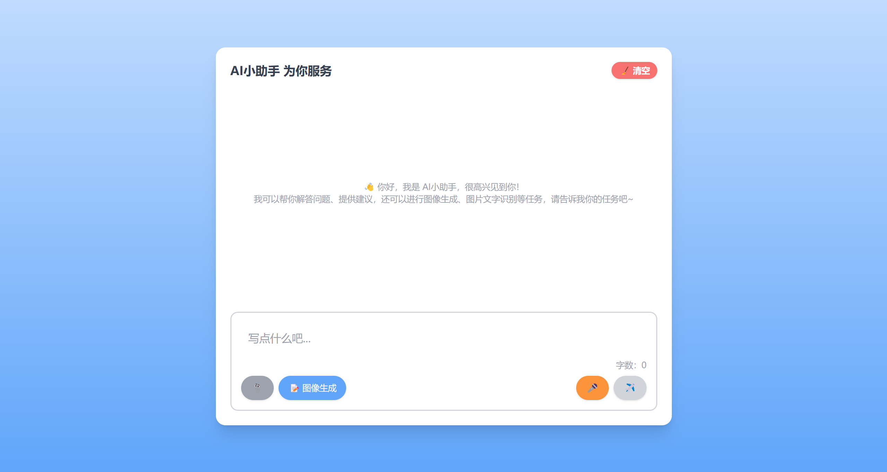
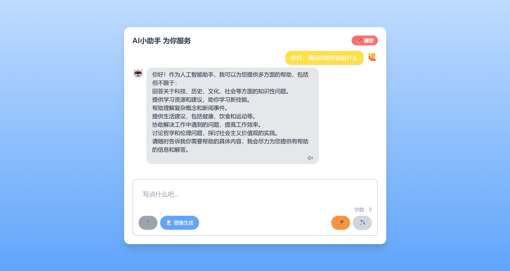
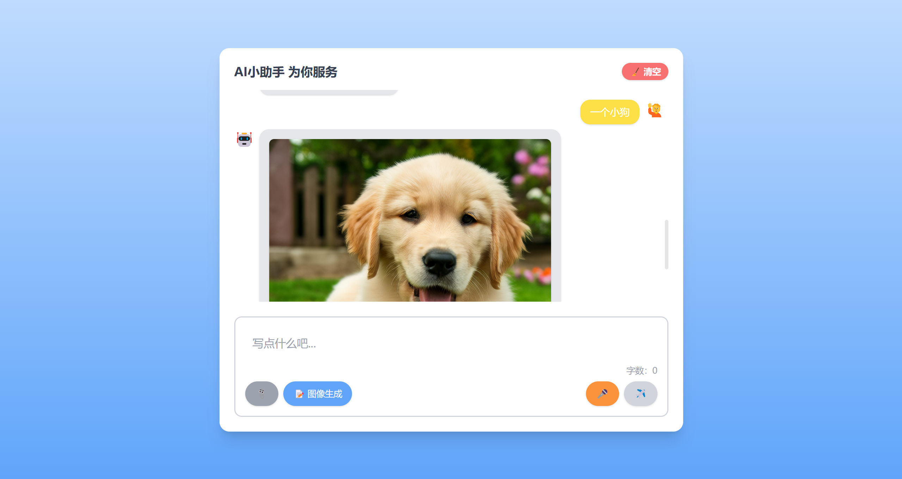
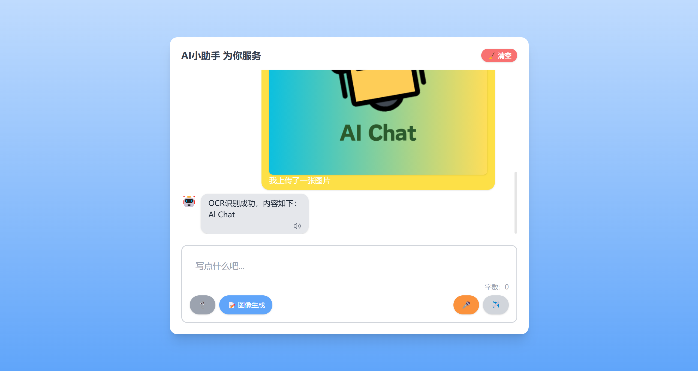

# AI 多模态智能助手平台

一个基于 React 构建的多模态智能助手应用，支持多模态输入（文字、语音、图像）与实时聊天对话，提升用户交互体验。应用通过 WebSocket 实现流式响应与打字机效果，同时利用 IndexedDB 优化消息历史存储，具有较高的性能和流畅的用户体验。

## 项目亮点

- **多模态输入支持**：图像 OCR 识别与语音识别功能，支持用户上传图片或通过语音输入与助手进行互动。
- **实时聊天体验**：通过 WebSocket 实现流式数据传输与打字机效果，确保对话的实时性与自然感。
- **前端性能优化**：通过 `react-virtuoso` 实现虚拟滚动，提升消息历史展示性能；使用 `IndexedDB` 存储聊天记录，提高数据存取速度与稳定性。
- **模块化设计**：项目采用模块化架构，易于扩展与维护，前后端代码分离，提高代码复用率。
- **完整部署流程**：前端通过 Vercel 部署，后端服务通过 Koyeb 云平台部署，实现自动化部署和 CI/CD 管道。

## 项目截图

项目界面


聊天回复


图片生成


图片 OCR 识别


项目演示


## 功能特性

- **文字输入**：用户可以直接输入文字与助手进行对话。
- **语音识别**：支持语音输入，自动将语音转换为文字进行处理。
- **图像 OCR**：用户上传图片，智能助手自动识别图中的文字内容。
- **图像生成**：智能助手根据用户描述生成相应图像。
- **聊天记录**：自动保存聊天记录，用户切换角色时保持对话历史。
- **WebSocket 支持**：实时响应，消息逐字显示，提升用户体验。

## 技术栈

- **前端**：
  - React
  - TypeScript
  - TailwindCSS
  - WebSocket
  - IndexedDB
  - react-virtuoso
- **后端**：
  - Node.js
  - Express
  - WebSocket
  - Axios（API 请求）
- **其他**：
  - Vercel（前端部署）
  - Koyeb（后端部署）

## 安装与使用

### 克隆项目

```bash
git clone https://github.com/isawitbeforepipi/AI-Assistant-React.git
cd AI-智能助手
```

### 前端安装与启动

进入 项目根目录并安装依赖：

```bash
npm install
npm start
```

### 后端安装与启动

进入 backend 目录并安装依赖：

```bash
cd backend
npm install
node server.js
```

### 环境变量配置

在项目 backend 目录创建 .env 文件，填入以下配置：

```bash
ZHIPU_API_KEY = your_zhipu_api_key
BAIDU_OCR_API_KEY = your_baidu_ocr_api_key
BAIDU_OCR_SECRET_KEY = your_baidu_ocr_secret_key
GENERATE_IMG_API_KEY = your_aliyun_api_key
```
